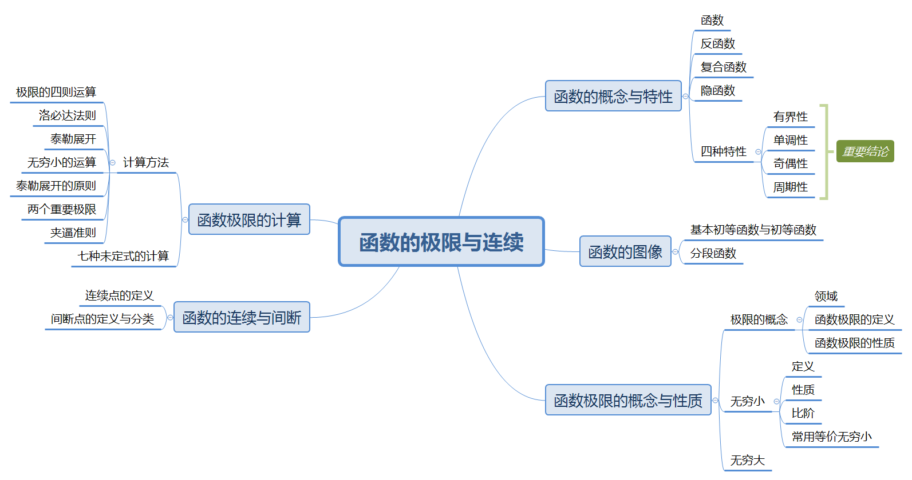

# 函数的极限与连续

# 知识框架

# 一、函数的概念与特性

## 2.1 函数的概念
* 函数是单值函数，每个横坐标最多对应一个纵坐标
* 反函数中
  * $` y = \ln(x + \sqrt{x^2+1}) `$ 是**反双曲正弦函数**，
  * $`y = \frac{e^x - e^{-x}} {2} `$ 是**双曲正弦函数**，
  * $`y=\frac{e^x+e^{-x}} {2}`$是**双曲余弦函数**
* $` y = \ln(x + \sqrt{x^2+1}) `$的性质有：
  * 它是奇函数
  * $`x\to0`$ 时有 $` y = \ln(x + \sqrt{x^2+1}) \sim x`$
  * $` [y = \ln(x + \sqrt{x^2+1})]' = \frac{1} {\sqrt{x^2+1}}`$
 
## 2.2 函数的特性
* $` f(x) + f(-x) `$ 必是偶函数
* $` f(x) - f(-x) `$ 必是奇函数
* 复合函数有有一层是偶函数则总体是偶函数

# 二、函数的图像
* $`y=arcsin(x)`$ 的主值区间为 $`[-\pi/2, \pi/2]`$
* $`y=arccos(x)`$ 的主值区间为 $`[0, \pi]`$
* 关注反三角函数的值域和定义域

$$
\begin{array}{l}
\sin (\arcsin x)=x, x \in[-1,1], \sin (\arccos x)=\sqrt{1-x^{2}}, x \in[-1,1] \\
\cos (\arccos x)=x, x \in[-1,1], \cos (\arcsin x)=\sqrt{1-x^{2}}, x \in[-1,1] \\
\arcsin (\sin y)=y, y \in\left[-\frac{\pi}{2}, \frac{\pi}{2}\right] \\
\arccos (\cos y)=y, y \in[0, \pi] \\
\arcsin x+\arccos x=\frac{\pi}{2}(-1 \leqslant x \leqslant 1)
\end{array}
$$

# 三、函数极限的概念与性质
## 3.1 极限

* 极限的性质
  * 唯一性：极限存在则唯一
  * 局部有界性
  * 局部保号性
* 脱帽严格不等
$$
\begin{array}{l}
\lim f > 0 \Rightarrow f > 0 \\
\lim f < 0 \Rightarrow f < 0 \\
\end{array}
$$

* 戴帽不严格不等
$$
\begin{array}{l}
f \ geq 0 \Rightarrow \lim f \geq 0 \\
f \ leq 0 \Rightarrow \lim f \leq 0 \\
\end{array}
$$
